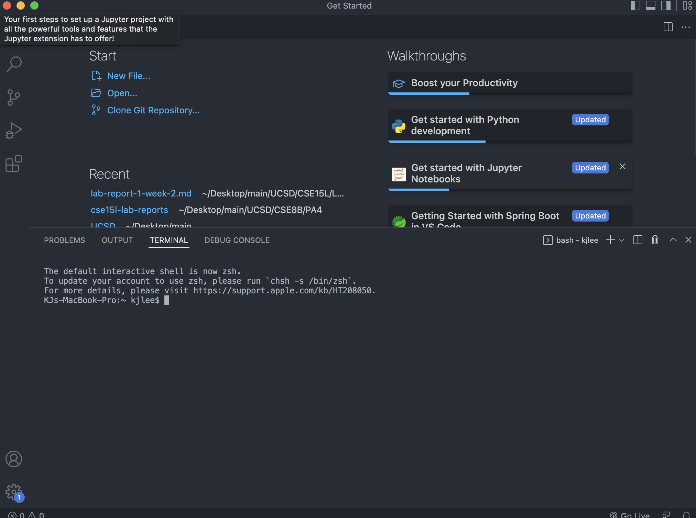
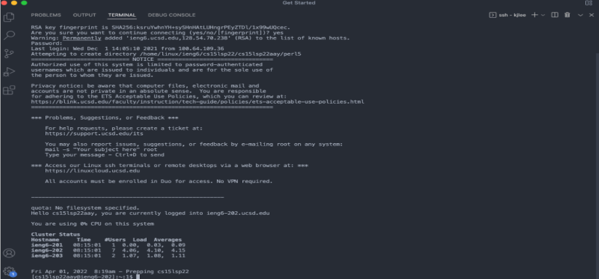
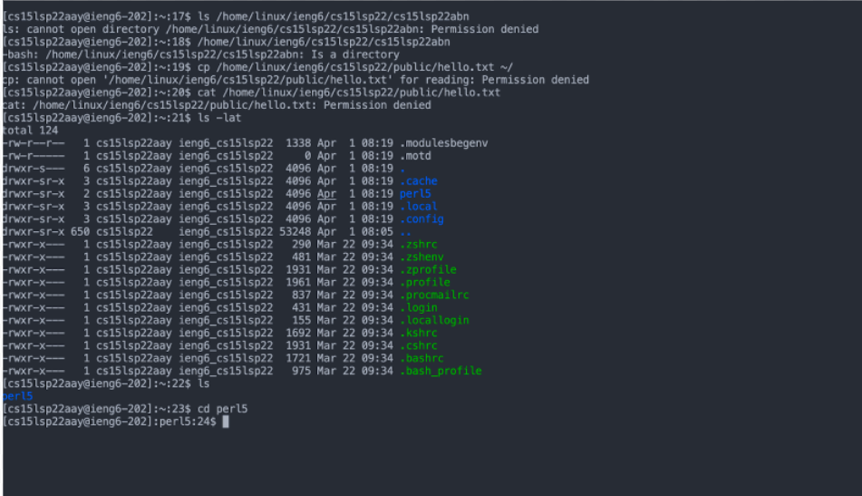
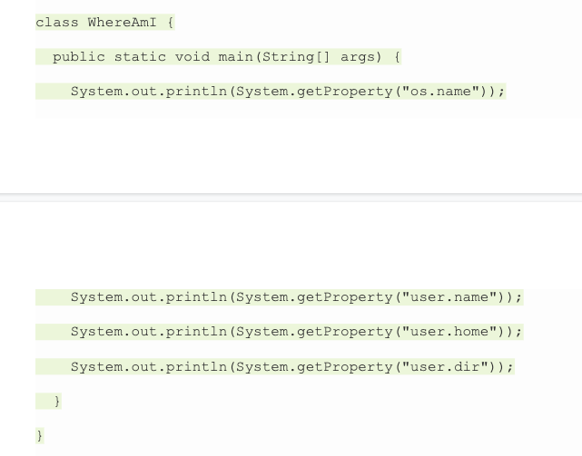
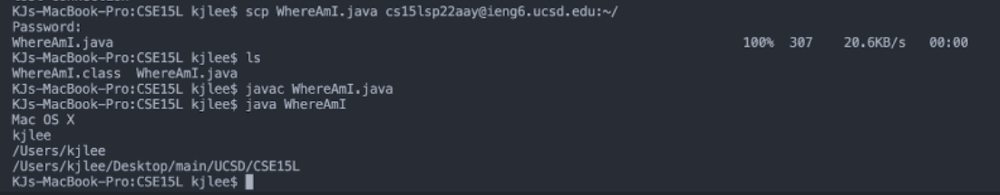
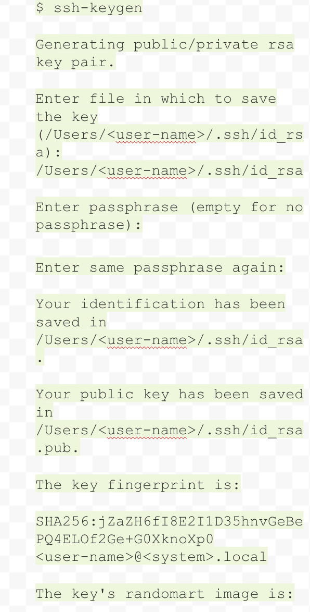
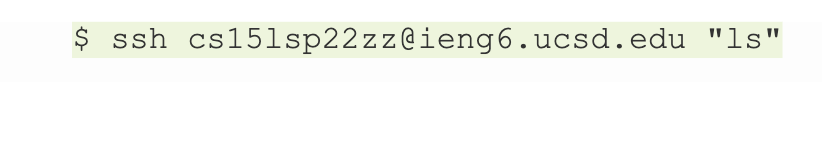
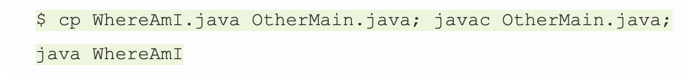

# How to *Remotely* log-in to your ieng6 account
First make sure that you have done the prerequiste for the lab by changing your password

## VS Code
We will start by opening vs code and opening the terminal
It should look a little something like this

## Remotely logging in
Once completed we can log into our account

Copy this code with your account name
cs15lsp22abc@ieng6.ucsd.edu
__Note: use your account, it most likely wont be abc__

It should prompt you for a password 

Type in your password and it should look like this!

__Note: The computer isn't going to make little asteriks when you type your password. It will look blank. Just type in your password and press enter when done__

Once you've logged in the computer should output a big wall of text and look like this.

## Running some commands
Once inside we can try some commands
Here are some of my recommendations
- cd
- ls
- cd perl5
- cd ~

After I run these commands this is what my terminal looks like, see if yours matches

## Moving files using SCP
Now were going to learn how to copy and move files over using `scp`

Create a file in VS Code called `WhereAmI.java`

Once created just copy this code down

after running the code using the javac and java commands lets try to move this over to our account

Type this command into the terminal

scp WhereAmI.java cs15lsp22zz@ieng6.ucsd.edu:~/

Once you're logged in type `ls` and you should see your file in your account!

## SSH keys
Typing your password can get a little annoying :(

Theres an awesome solution to this problem that is ssh keys

ssh keys in the grand scheme of things creates a private key and a public key that allows easier access into your server account

Lets start by opening the terminal on your client computer

Type this code in 

`$ ssh-keygen`

Your computer should load up something like this

__Note: When you get to the paraphrase part DO NOT type anything just press enter__

If we try logging into the server now you should gain access without having to type a password

## Remote optimization
Here are some helpful ways we can optimize how we code

- Tip 1: Using quotations allow you to run log in and run a piece of code at the same time.

- Tip 2: Using semi colons allows you to run multiple commands at the same time in order.

